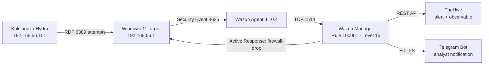

[README (3).md](https://github.com/user-attachments/files/33059499/README.3.md)
# SOC Implementation Lab: Wazuh / TheHive / Telegram

Proof-of-concept Security Operations Center laboratory that detects, contains, and escalates
**Windows authentication brute force** (MITRE ATT&CK **T1110**), with RDP used as the simulated attack vector.

> **Scope:** isolated lab (host-only `192.168.56.0/24`), controlled simulation. This repository
> **bukan** laporan insiden nyata dan tidak mengklaim adanya kompromi sistem.

| | |
|---|---|
| **Author** | Labib Rahmattullah |
| **Period** | 12-27 Agustus 2026 |
| **Platform** | Wazuh 4.10.4 (Manager, Indexer, Dashboard), TheHive, Telegram Bot API |
| **Environment** | VirtualBox / Hyper-V, Kali Linux (attacker + stack keamanan), Windows 11 (target) |
| **Contact** | [LinkedIn](https://linkedin.com/in/labib-rahmattullah) |

---

## Results Summary

One use case was built and validated end-to-end: **Rule 100001** detects a login-failure pattern,
Active Response blocks the source IP in Windows Firewall, the block expires automatically, the alert is ingested by
TheHive, and the analyst receives a notification Telegram.

| Capability | Status | Evidence |
|---|---|---|
| Wazuh Agent-to-Manager connectivity | Validated | Fig. 2, 3 |
| Rule 100001 (5 event / 60 seconds, same source IP, Level 15, T1110) | Validated | Fig. 11, 14 |
| Active Response `firewall-drop` (rule firewall terbentuk di target) | Validated | Fig. 16, 17 |
| Efek blokir terlihat dari sisi attacker | Validated | Fig. 10, 18 |
| Auto-expiry blokir (timeout 600 seconds) | Validated | Fig. 19 |
| Alert + observable masuk ke TheHive | Validated | Fig. 21, 22 |
| Telegram Notification untuk Rule 100001 | Validated | Fig. 24 |
| Rule 100020 Password Spraying | Event samples only (alert not demonstrated) | Fig. 12 |
| Rule 100002-100010, 100022, 100201, 100203, 100206, 100005 | **Configured only** | docs/02 |
| Dashboard SOC | Panel library only; metrics not validated | Fig. 20 |

**Status definition:** *Configured* = present in configuration. *Validated* = alert/action/artifact evidence is present
dalam laporan ini. Rules that are only configured are not presented as tested detections.

---

## Architecture



Details: [docs/01-architecture.md](docs/01-architecture.md)

## Detection and Response Flow

```
Hydra attempts -> Event ID 4625 -> Wazuh Agent -> Manager (Rule 100001)
   -> Alert -> Active Response (firewall-drop, 600 s) -> source IP diblokir
   -> TheHive alert + observable -> Telegram notification
   -> Analyst triage -> Case closure (True Positive, No Impact)
   -> Blokir kedaluwarsa otomatis
```

## Detection Logic

```xml
<rule id="100001" level="15" frequency="5" timeframe="60">
  <if_matched_sid>60122</if_matched_sid>
  <same_field>win.eventdata.ipAddress</same_field>
  <description>CRITICAL: High volume brute force authentication attack detected on Windows host</description>
  <mitre><id>T1110</id></mitre>
</rule>
```

Interpretation notes maintained throughout the documentation:

- **Event ID 4625 = kegagalan autentikasi**, bukan bukti RDP. Atribusi RDP butuh Logon Type 10 atau bukti sesi lain; sampel yang ditampilkan memakai Logon Type 3. Rule RDP-spesifik (100005) hanya *configured*.
- **Level 15** adalah severity hasil konfigurasi, bukan konfirmasi aktivitas berbahaya.
- **TheHive** dideskripsikan sebagai case management. Orkestrasi/playbook (mis. Cortex responders) tidak didemonstrasikan, sehingga istilah "SOAR penuh" tidak dipakai.

## Repository Structure

```
.
├── README.md
├── docs/
│   ├── 01-architecture.md                # komponen, topologi, alur data
│   ├── 02-detection-engineering.md       # Rule 100001 + katalog rule + status validasi
│   ├── 03-response-and-integrations.md   # Active Response, whitelist, TheHive, Telegram
│   ├── 04-validation-evidence.md         # indeks bukti: what it proves / tidak
│   ├── 05-limitations-and-next-steps.md  # keterbatasan, gap, rencana perbaikan
│   └── report/                           # laporan lengkap (.docx)
├── configs/                              # potongan konfigurasi (tanpa kredensial)
├── integrations/                         # custom-telegram.py (versi sanitasi)
├── assets/images/                        # screenshot bukti Figure 1-24
├── SECURITY.md
├── LICENSE
└── .gitignore
```

## Cara Mereproduksi (hanya di isolated lab milik sendiri)

1. Verify the agent on Windows (PowerShell elevated):
   ```powershell
   Restart-Service -Name "wazuh"
   Get-Content "C:\Program Files (x86)\ossec-agent\ossec.log" -Tail 20
   ```
2. Apply Rule 100001 ([configs/local_rules.rule-100001.xml](configs/local_rules.rule-100001.xml)) dan
   blok Active Response ([configs/ossec.active-response.snippet.xml](configs/ossec.active-response.snippet.xml)) on the Manager, then restart the Manager.
3. Simulate from Kali against **your own lab target**:
   ```bash
   hydra -l hacker_test -P passlist.txt rdp://192.168.56.1 -t 4 -V
   ```
4. Verify on the target:
   ```powershell
   Get-NetFirewallRule | Where-Object { $_.DisplayName -like "*Wazuh*" }
   ```
   Dari Kali: `nc -zvw3 192.168.56.1 445` (timeout = konsisten dengan DROP). Repeat the firewall query setelah 600 seconds to verify auto-expiry.

## MITRE ATT&CK Mapping

| Tactic | Technique | Coverage |
|---|---|---|
| Credential Access | T1110 Brute Force | Rule 100001, **validated** |
| Credential Access | T1110.003 Password Spraying | Rule 100020, event samples |
| Credential Access | T1110.001 Password Guessing | Rule 100005, configured |
| Persistence | T1136.001 Local Account | Rule 100002, configured |
| Persistence / Priv. Esc. | T1098 Account Manipulation | Rule 100003, configured |
| Defense Evasion | T1562.002 / T1562.004 / T1562.001 | Rule 100004 / 100009 / 100201, configured |
| Impact | T1490 Inhibit System Recovery | Rule 100006, configured |
| Credential Access | T1003.001 LSASS Memory | Rule 100007 / 100022, configured |
| Execution | T1059.001 PowerShell | Rule 100008 / 100203 / 100206 / 100201, configured |
| Persistence | T1053.005 Scheduled Task | Rule 100010, configured |

## Key Limitations

Summary; details in [docs/05-limitations-and-next-steps.md](docs/05-limitations-and-next-steps.md).

- Hanya satu rantai deteksi-respons yang divalidasi ujung ke ujung; rule lain masih *configured*.
- Attacker, Wazuh Manager, dan TheHive berbagi host `192.168.56.101` (penyederhanaan lab).
- MTTD/MTTC belum dihitung dari timestamp lintas sumber; false-positive rate belum diukur.
- Target brute force memakai akun yang tidak ada (`hacker_test`); skenario login sukses (Event 4624) tidak dicakup.

## Responsible Use

All techniques here are for your own lab or an environment where you have written authorization.
See [SECURITY.md](SECURITY.md).

## Lisensi

MIT. Lihat [LICENSE](LICENSE).
