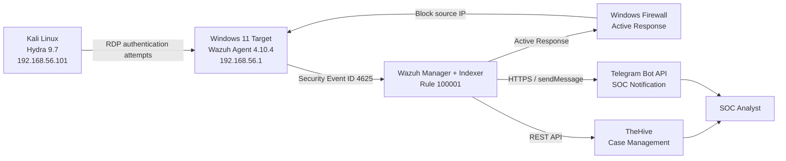

[README (4).md](https://github.com/user-attachments/files/33060067/README.4.md)
# SOC Implementation Lab — Wazuh, TheHive & Telegram

> **Security Operations Center (SOC) Proof of Concept** for Windows authentication brute-force detection, automated endpoint containment, incident escalation, and analyst notification.


This repository documents an isolated SOC laboratory designed to demonstrate the complete lifecycle of a security alert:

**Attack Simulation → Windows Telemetry → Wazuh Detection → Automated Containment → TheHive Escalation → Telegram Notification → Analyst Closure**

The primary validated use case is **Windows authentication brute force**, mapped to **MITRE ATT&CK T1110 (Brute Force)**. RDP was used as the simulated attack vector.

> **Important:** This is a controlled laboratory exercise. It is not a real incident and does not claim that a production system was compromised.

---

## 1. Project Overview

This project implements a lightweight SOC architecture using open-source and custom components. The objective is not simply to generate an alert, but to demonstrate how a SOC can move from raw endpoint telemetry to automated containment and analyst-facing incident management.

The validated pipeline consists of:

1. Kali Linux generates controlled authentication attempts against the Windows target.
2. Windows generates failed authentication telemetry through **Security Event ID 4625**.
3. Wazuh Agent forwards endpoint telemetry to the Wazuh Manager.
4. Wazuh Rule **100001** correlates repeated authentication failures.
5. The Wazuh Manager triggers **Active Response `firewall-drop`**.
6. Windows Firewall blocks the attacking source IP.
7. The temporary block automatically expires after **600 seconds**.
8. The alert is forwarded to **TheHive** as a structured alert/case with an IP observable.
9. A custom Python integration sends a formatted alert to **Telegram**.
10. The analyst reviews and closes the case as **True Positive / No Impact**.

The laboratory report was prepared by **Labib Rahmattullah**, with the reporting period **12–27 August 2026**, using an isolated Hyper-V / VirtualBox host-only environment.

---

## 2. Objectives

The laboratory was designed to validate the following SOC capabilities:

- Detect Windows authentication brute-force activity using native Windows Security telemetry.
- Correlate repeated failed authentication events through a custom Wazuh rule.
- Automatically contain the source IP at the endpoint firewall.
- Escalate Wazuh alerts into TheHive for structured case management.
- Deliver near-real-time analyst notifications through Telegram.
- Build a SOC visualization/dashboard layer for situational awareness.
- Map detections to the MITRE ATT&CK framework.
- Establish a reusable foundation for future detection-engineering and threat-hunting use cases.

---

## 3. Scope

The primary validated use case is:

**Windows Authentication Brute Force → MITRE ATT&CK T1110**

The simulation was conducted on an isolated host-only network:

```text
192.168.56.0/24
```

RDP was used as the attack vector during the controlled Hydra simulation.

The project deliberately distinguishes between:

- **Validated** — evidence demonstrates that the detection/action worked.
- **Event Samples** — telemetry was observed, but the complete detection chain was not demonstrated.
- **Configured** — the rule/configuration exists but has not yet been fully validated.

This distinction is important because a configured detection rule should not automatically be presented as a proven detection capability.

---

# 4. Architecture

## 4.1 High-Level Architecture



## 4.2 Logical Data Flow

```text
Windows Security Event ID 4625
            |
            v
     Wazuh Agent
            |
       TCP / 1514
            |
            v
     Wazuh Manager
     Analysisd / Rules
            |
            +----------------------+
            |                      |
            v                      v
     Rule 100001              Integrations
     Level 15                      |
            |              +-------+-------+
            |              |               |
            v              v               v
   Active Response      TheHive         Telegram
   firewall-drop       Alert/Case       Notification
            |              |               |
            v              +-------+-------+
   Windows Firewall               |
            |                     v
            +----------------> SOC Analyst
```

---

# 5. Laboratory Environment

| Role | Component | OS | Address | Function |
|---|---|---|---|---|
| Attacker | Kali Linux + Hydra 9.7 | Kali Linux Rolling | `192.168.56.101` | Controlled brute-force simulation |
| Target / Endpoint | Windows 11 + Wazuh Agent 4.10.4 | Windows 11 Home Single Language | `192.168.56.1` | Generates Security Events and executes Active Response |
| Manager / SIEM | Wazuh Manager + Indexer | Kali Linux, co-located | `192.168.56.101` | Collection, decoding, correlation, detection and response |
| SOAR / Case Management | TheHive | Kali Linux, co-located | `192.168.56.101:9000` | Alert/case management and observable tracking |
| Notification | Telegram Bot API + `custom-telegram.py` | Python 3 | `api.telegram.org` | Analyst notification |

### Network Design

The environment uses a **host-only virtual network** so that attack traffic remains isolated from production and external networks.

The Wazuh Agent communicates with the Manager over **TCP/1514**.

The laboratory intentionally co-locates the attacker, Wazuh stack, and TheHive on `192.168.56.101` for resource efficiency. This is a laboratory simplification and should not be treated as a production architecture.

---

# 6. Detection Engineering

## 6.1 Primary Detection — Rule 100001

The primary validated detection is Wazuh **Rule 100001**.

```xml
<rule id="100001" level="15" frequency="5" timeframe="60">
  <if_matched_sid>60122</if_matched_sid>
  <same_field>win.eventdata.ipAddress</same_field>
  <description>CRITICAL: High volume brute force authentication attack detected on Windows host</description>
  <mitre>
    <id>T1110</id>
  </mitre>
</rule>
```

### Detection Logic

```text
IF failed authentication events match SID 60122
AND at least 5 matching events occur
AND the events occur within 60 seconds
AND the source IP is the same
THEN trigger Rule 100001
```

### Rule Characteristics

| Attribute | Value |
|---|---|
| Rule ID | `100001` |
| Level | `15` |
| Base Event | SID `60122` / Windows authentication failure |
| Frequency | `5` events |
| Timeframe | `60 seconds` |
| Correlation Field | `win.eventdata.ipAddress` |
| MITRE | `T1110 — Brute Force` |
| Status | **Validated** |

The Wazuh Discover evidence showed Rule 100001 firing at Level 15 with `rule.firedtimes = 6` and `rule.frequency = 5`. The `previous_output` evidence demonstrated that the alert was produced by event correlation rather than by a single authentication failure.

---

# 7. Windows Event ID 4625

The primary endpoint telemetry is **Windows Security Event ID 4625**, representing a failed logon.

The project deliberately distinguishes the event from the attack vector:

> **Event ID 4625 proves a failed authentication attempt; it does not, by itself, prove that the authentication occurred through RDP.**

The documented samples used **Logon Type 3 (Network)**. Therefore, the primary validated claim is **Windows authentication brute force**, while the RDP-specific rule remains a future validation item.

For actual RDP attribution, the project identifies **Logon Type 10** as the required evidence for the RDP-specific detection.

---

# 8. Active Response

Detection alone does not stop an attack. The laboratory therefore binds Rule 100001 to Wazuh Active Response.

```xml
<active-response>
  <command>firewall-drop</command>
  <location>local</location>
  <rules_id>100001</rules_id>
  <timeout>600</timeout>
</active-response>
```

### Design

`rules_id=100001` means that the containment action is tied specifically to the validated detection instead of being triggered by every high-severity alert.

`location=local` causes the response to be executed on the endpoint that generated the alert.

`timeout=600` configures a temporary **10-minute block**.

This is an important safety property because a false positive should not leave a permanent firewall rule without human review.

---

# 9. Active Response Validation

The response was validated using multiple independent observations.

### Endpoint evidence

The Windows target showed a dynamically created firewall rule:

```text
WAZUH ACTIVE RESPONSE BLOCKED IP
```

The rule was:

```text
Enabled  : True
Direction: Inbound
Action   : Block
```

The report also records `PrimaryStatus: OK` and a valid local Windows Filtering Platform policy state.

### Attacker-side evidence

A connectivity test from Kali was performed:

```bash
nc -zvw3 192.168.56.1 445
```

The observed result was a **timeout**, consistent with a firewall-level packet drop rather than an immediate service-level rejection.

Hydra also began reporting connection failures during the simulation after the containment action took effect.

### Automatic expiry

After the configured 600-second timeout, the firewall rule was queried again and was no longer present.

This validates the complete containment lifecycle:

```text
Detection
   ↓
Firewall Block
   ↓
Attack Disrupted
   ↓
600-second Timeout
   ↓
Firewall Rule Removed
```

---

# 10. Telegram Integration

The laboratory uses a custom Python integration:

```text
integrations/custom-telegram.py
```

The integration receives the Wazuh alert JSON and extracts fields such as:

- Rule ID
- Rule description
- Severity level
- Agent name
- Agent IP
- Source IP
- Command line, when available

It then formats an HTML message and sends it through Telegram Bot API's `sendMessage` endpoint.

Conceptually:

```text
Wazuh Alert JSON
       |
       v
custom-telegram.py
       |
       +--> Parse rule / agent / source information
       |
       v
Telegram Bot API
       |
       v
SOC Analyst
```

Credentials must be supplied through environment variables rather than committed to the repository.

The Telegram evidence confirms delivery of a Rule 100001 notification containing the alert severity, target agent, and source IP.

---

# 11. TheHive Integration

The Wazuh Manager forwards qualifying Rule 100001 alerts to TheHive through its REST API.

TheHive receives:

```text
Wazuh Rule 100001
       |
       v
TheHive Alert
       |
       v
Source IP Observable
       |
       v
Analyst Investigation
       |
       v
Case Closure
```

The validated case contained the source IP as an observable and maintained traceability to the originating Wazuh alert.

The final analyst disposition was:

```text
Status : True Positive
Impact : No Impact
```

The case summary documented the detected brute-force activity, successful firewall containment, and absence of observed system compromise.

> The project validates TheHive as case/incident management. It does **not** claim a full automated SOAR/Cortex orchestration workflow.

---

# 12. SOC Dashboard

A dedicated SOC visualization catalog was constructed in the Wazuh/Kibana dashboard environment.

The documented visualization library included:

- Brute Force Threat Meter
- Total Brute Force Events
- Total Critical/High Alerts
- Real-Time High/Critical Alert Stream
- Alert Volume Trend
- Attacking IP tables
- Targeted Username tables
- Geographic origin visualization
- MITRE-aligned incident response/playbook information

The main dashboard screenshot was intentionally omitted from the revised report because duplicated KPI values had not been independently validated against each query.

Therefore:

**Dashboard panel construction: demonstrated**

**Production-quality KPI validation: not yet demonstrated**

---

# 13. Detection Rule Catalog

The project includes an extended rule set beyond the primary validated use case.

## Authentication and Account Management

| Rule | Use Case | Logic / Event | MITRE | Level | Status |
|---|---|---|---|---:|---|
| `100001` | Windows Authentication Brute Force | SID 60122; 5/60s; same source IP | T1110 | 15 | **Validated** |
| `100020` | Password Spraying | Event 4625; 5/120s | T1110.003 | 12 | Event samples |
| `100002` | New User Account | Event 4720 | T1136.001 | 10 | Configured |
| `100003` | Privileged Group Change | Event 4732 | T1098 | 12 | Configured |
| `100004` | Audit Policy Modification | Event 4719 | T1562.002 | 8 | Configured |
| `100005` | RDP Brute Force | SID 60122 + Logon Type 10; 5/60s | T1110.001 | 13 | Configured |

## Execution, Persistence and Defense Evasion

| Rule | Use Case | Logic / Event | MITRE | Level | Status |
|---|---|---|---|---:|---|
| `100006` | VSS Deletion / Ransomware Precursor | `vssadmin` / `wmic` / `wbadmin` shadow deletion | T1490 | 14 | Configured |
| `100007` | LSASS Memory Dump | `rundll32` + `comsvcs` MiniDump | T1003.001 | 13 | Configured |
| `100008` | PowerShell Download / Encoded Execution | PowerShell + encoded/download terms | T1059.001 | 12 | Configured |
| `100009` | Firewall Tampering | `netsh advfirewall state off` | T1562.004 | 11 | Configured |
| `100010` | Scheduled Task Persistence | Event 4698 | T1053.005 | 10 | Configured |
| `100206` | PowerShell Web Request | `Invoke-WebRequest` / `IWR` | T1059.001 | 5 | Configured |
| `100201` | Encoded PowerShell Command | CommandInvocation + encoded terms | T1059.001 / T1562.001 | 8 | Configured |
| `100203` | Risky PowerShell Cmdlet | Event 4104 + cmdlet list | T1059.001 | 10 | Configured |
| `100022` | LSASS Credential Dumping | Windows group + `comsvcs.dll` match | T1003.001 | 14 | Configured |

### Validation Maturity Model

The project uses this progression for future detection engineering:

```text
Configured
    ↓
Tested
    ↓
Triggered
    ↓
Fully Validated
    ↓
False-Positive Measurement
    ↓
Eligible for Automated Response
```

Configured rules should not be treated as production-ready detections until their behavior and false-positive characteristics have been validated.

---

# 14. MITRE ATT&CK Mapping

| Tactic | Technique | Project Coverage |
|---|---|---|
| Credential Access | T1110 — Brute Force | Rule 100001 — **Validated** |
| Credential Access | T1110.003 — Password Spraying | Rule 100020 — Event samples |
| Credential Access | T1110.001 — Password Guessing | Rule 100005 — Configured |
| Persistence | T1136.001 — Local Account | Rule 100002 — Configured |
| Persistence / Privilege Escalation | T1098 — Account Manipulation | Rule 100003 — Configured |
| Defense Evasion | T1562.002 / T1562.004 / T1562.001 | Rules 100004 / 100009 / 100201 — Configured |
| Impact | T1490 — Inhibit System Recovery | Rule 100006 — Configured |
| Credential Access | T1003.001 — LSASS Memory | Rules 100007 / 100022 — Configured |
| Execution | T1059.001 — PowerShell | Rules 100008 / 100203 / 100206 / 100201 — Configured |
| Persistence | T1053.005 — Scheduled Task | Rule 100010 — Configured |

---

# 15. End-to-End Validation

The main validated scenario can be summarized as follows:

```text
1. Hydra starts controlled authentication attempts
                    ↓
2. Windows generates Event ID 4625
                    ↓
3. Wazuh Agent forwards telemetry
                    ↓
4. Wazuh correlates 5 failures / 60 seconds
                    ↓
5. Rule 100001 fires at Level 15
                    ↓
6. Active Response executes firewall-drop
                    ↓
7. Windows Firewall blocks source IP
                    ↓
8. Hydra / network test observes connection failure
                    ↓
9. 600-second timeout expires
                    ↓
10. Firewall rule is automatically removed
                    ↓
11. Wazuh sends alert to TheHive
                    ↓
12. TheHive stores source IP as observable
                    ↓
13. Telegram sends analyst notification
                    ↓
14. Analyst reviews and closes case
                    ↓
15. True Positive / No Impact
```

---

# 16. Validation Matrix

| Capability | Result | Evidence |
|---|---|---|
| Wazuh Agent → Manager connectivity | **Validated** | Figures 2–3 |
| Rule 100001 correlation | **Validated** | Figures 11 & 14 |
| Active Response firewall rule | **Validated** | Figures 16–17 |
| Attacker-side containment effect | **Validated** | Figures 10 & 18 |
| 600-second auto-expiry | **Validated** | Figure 19 |
| TheHive alert + observable | **Validated** | Figures 21–22 |
| Analyst case closure | **Validated** | Figure 23 |
| Telegram notification | **Validated** | Figure 24 |
| Password Spraying Rule 100020 | **Event samples only** | Figure 12 |
| Extended detection rules | **Configured only** | Figures 5–6 |
| SOC visualization catalog | **Demonstrated** | Figure 20 |
| Fully validated dashboard KPI accuracy | **Not demonstrated** | Main dashboard omitted |

---

# 17. Security Analysis

Several architectural decisions are important from a SOC engineering perspective.

### Rule-specific Active Response

The response is bound directly to Rule 100001 instead of a broad severity threshold. This reduces the possibility of an unrelated high-severity event triggering a firewall action.

### Temporary Containment

The 600-second timeout limits the operational impact of an incorrect automated response. It provides containment while allowing the system to recover automatically.

### Independent Containment Layer

The firewall containment occurs directly on the endpoint. Therefore, the containment mechanism does not depend on TheHive or Telegram being available.

### Evidence-Based Validation

The project uses both target-side and attacker-side evidence. The Windows firewall rule proves that containment was enforced, while the network timeout and Hydra connection failures provide independent confirmation from the attacker's perspective.

### Detection Accuracy Still Requires Measurement

The current 5-events/60-seconds threshold is a laboratory configuration. A production deployment should establish normal authentication-failure baselines per endpoint before automatically blocking users or source IPs.

---

# 18. Evaluation

| Metric | Observed Result | Assessment |
|---|---|---|
| Detection threshold | 5 failed logons / 60 seconds | Validated through Wazuh alert evidence |
| Time to detection | Alert generated when configured threshold was reached | Exact MTTD requires cross-source timestamps |
| Time to containment | Firewall block occurred before Hydra completed its wordlist | Sub-attack-duration response observed |
| Containment verification | Firewall query + netcat timeout | Two independent methods corroborate enforcement |
| Block duration | 600 seconds | Automatic expiry validated |
| SOAR escalation | TheHive alert + IP observable | End-to-end SIEM-to-case pipeline validated |
| Analyst notification | Telegram message delivered | Out-of-band notification validated |

The report intentionally does not claim an exact MTTD/MTTC value because a rigorous measurement requires timestamp comparison across the relevant source logs.

---

# 19. Limitations

This project is a proof of concept, not a production SOC.

The main limitations are:

1. Only Rule 100001 is validated end-to-end.
2. Rule 100020 has supporting Event 4625 samples, but its full alert chain is not demonstrated.
3. Rules 100002–100010, 100005, 100022, 100201, 100203 and 100206 remain configured rather than fully validated.
4. The Event 4625 samples use Logon Type 3; RDP attribution has not been independently demonstrated through Logon Type 10.
5. Attacker, Wazuh Manager and TheHive share `192.168.56.101`, which is a laboratory simplification.
6. Exact MTTD and MTTC have not been calculated from synchronized timestamps.
7. False-positive rate has not been measured.
8. The brute-force simulation used an intentionally invalid account, `hacker_test`; successful authentication scenarios were not covered.
9. The Active Response timeout is fixed at 600 seconds.
10. Telegram filtering requires further tuning because the channel can receive alerts beyond Rule 100001.
11. Cortex enrichment/responders were not demonstrated.
12. The dashboard panel catalog was demonstrated, but the omitted main dashboard metrics were not independently validated.

---

# 20. Recommended Improvements

The next engineering steps are:

### Detection Engineering

- Establish per-host authentication-failure baselines.
- Tune frequency/timeframe thresholds using observed legitimate behavior.
- Measure false positives before binding detections to automated response.
- Validate Rule 100005 using real RDP authentication telemetry with Logon Type 10.
- Validate the extended PowerShell, LSASS, ransomware, firewall-tampering and persistence rules individually.

### Automated Response

- Create trusted management IP exclusions.
- Separate the attacker host from the security stack in a more realistic architecture.
- Introduce escalating timeout policies for repeated offenders.
- Validate response rollback and failure-handling behavior.

### SOAR / Threat Intelligence

- Integrate Cortex analyzers/responders for IOC enrichment.
- Add IP reputation enrichment.
- Develop structured analyst playbooks.
- Evaluate automated escalation to a Level-2 workflow.

### Identity Security

- Recommend MFA for accounts targeted by brute-force activity.
- Evaluate account lockout policies.
- Add a successful-login correlation scenario using Event 4624 after repeated Event 4625 failures.

### Measurement

- Capture timestamped `active-responses.log` and `alerts.json`.
- Calculate MTTD and MTTC from synchronized timestamps.
- Measure false-positive rates.
- Establish repeatable validation datasets.

---

# 21. Suggested Repository Structure

```text
.
├── README.md
├── SECURITY.md
├── LICENSE
├── .gitignore
│
├── docs/
│   ├── 01-architecture.md
│   ├── 02-detection-engineering.md
│   ├── 03-response-and-integrations.md
│   ├── 04-validation-evidence.md
│   ├── 05-limitations-and-next-steps.md
│   └── report/
│       └── SOC_Implementation_Report.docx
│
├── configs/
│   ├── local_rules.rule-100001.xml
│   ├── ossec.active-response.snippet.xml
│   └── ossec.global-whitelist.snippet.xml
│
├── integrations/
│   ├── custom-telegram.py
│   └── README.md
│
└── assets/
    └── images/
        ├── fig01-architecture-overview.png
        ├── fig02-agent-restart-ossec-log.png
        ├── ...
        └── fig24-telegram-notification.png
```

---

# 22. Reproduction Guide

> Run the following only against systems you own or explicitly have permission to test.

## Step 1 — Verify Wazuh Agent

On the Windows target, open an elevated PowerShell session:

```powershell
Restart-Service -Name "wazuh"
```

Check the agent log:

```powershell
Get-Content "C:\Program Files (x86)\ossec-agent\ossec.log" -Tail 20
```

The expected evidence is a successful connection to the Wazuh Manager at:

```text
192.168.56.101:1514
```

## Step 2 — Deploy the Detection Rule

Install the Rule 100001 configuration in the Wazuh Manager's local rules configuration.

Validate the configuration before restarting services.

The conceptual rule is:

```xml
<rule id="100001" level="15" frequency="5" timeframe="60">
  <if_matched_sid>60122</if_matched_sid>
  <same_field>win.eventdata.ipAddress</same_field>
  <description>CRITICAL: High volume brute force authentication attack detected on Windows host</description>
  <mitre>
    <id>T1110</id>
  </mitre>
</rule>
```

## Step 3 — Configure Active Response

```xml
<active-response>
  <command>firewall-drop</command>
  <location>local</location>
  <rules_id>100001</rules_id>
  <timeout>600</timeout>
</active-response>
```

Restart the relevant Wazuh service only after validating the configuration.

## Step 4 — Simulate the Attack in the Isolated Lab

The documented laboratory simulation used:

```bash
hydra -l hacker_test -P passlist.txt rdp://192.168.56.1 -t 4 -V
```

This command is included strictly as a reproduction reference for the isolated laboratory scenario documented by this project.

## Step 5 — Verify Endpoint Containment

On Windows:

```powershell
Get-NetFirewallRule | Where-Object { $_.DisplayName -like "*Wazuh*" }
```

Look for:

```text
WAZUH ACTIVE RESPONSE BLOCKED IP
```

Verify the rule is enabled and has a blocking action.

## Step 6 — Verify Network-Level Effect

From the authorized lab attacker host:

```bash
nc -zvw3 192.168.56.1 445
```

The documented validation produced a timeout consistent with firewall packet dropping.

## Step 7 — Verify Automatic Expiry

After the configured 600-second timeout:

```powershell
Get-NetFirewallRule | Where-Object { $_.DisplayName -like "*Wazuh*" }
```

The documented validation showed that the temporary block rule was no longer present.

## Step 8 — Verify TheHive and Telegram

Confirm that:

- Rule 100001 appears in TheHive.
- The source IP is recorded as an observable.
- The case can be reviewed and closed.
- The Telegram channel receives the formatted Wazuh notification.

---

# 23. Security and Responsible Use

This repository documents a defensive blue-team laboratory.

The attack simulation must only be performed:

- On systems owned by the operator.
- Inside an isolated laboratory.
- Or where explicit authorization has been granted.

Do not use the documented attack commands against public systems, third-party infrastructure, or networks without authorization.

### Credential Safety

Never commit:

```text
.env
*.key
*.pem
*.p12
*.pfx
client.keys
API tokens
Telegram bot tokens
Passwords
```

The Telegram integration should obtain credentials through environment variables.

If a credential is accidentally committed, rotate/revoke it immediately and clean the Git history. Simply deleting the file from the latest commit is not sufficient.

---

# 24. Evidence Documentation

The project report contains 24 figures documenting the implementation and validation process.

Important evidence includes:

| Figure | Evidence |
|---:|---|
| 1 | SOC macro architecture |
| 2 | Wazuh Agent restart and connection |
| 3 | Active Wazuh endpoint |
| 4–6 | Detection rule configuration |
| 7 | Active Response binding |
| 8 | Telegram integration logic |
| 9 | Global whitelist |
| 10 | Hydra simulation |
| 11 | Rule 100001 triggered |
| 12–14 | Event 4625 and correlation evidence |
| 15 | Active Response binaries |
| 16–17 | Windows Firewall block |
| 18 | Network timeout validation |
| 19 | Automatic firewall rule expiry |
| 20 | SOC dashboard visualization catalog |
| 21–23 | TheHive escalation and case closure |
| 24 | Telegram notification |

The evidence methodology intentionally separates what each figure **proves** from what it does **not prove**.

---

# 25. Project Outcome

The primary use case achieved the intended SOC lifecycle:

```text
DETECT
Windows authentication failures
        ↓
CORRELATE
5 events / 60 seconds / same source IP
        ↓
RESPOND
Wazuh Active Response
        ↓
CONTAIN
Windows Firewall blocks source IP
        ↓
VERIFY
Firewall + network evidence
        ↓
EXPIRE
600-second temporary block
        ↓
ESCALATE
TheHive alert + observable
        ↓
NOTIFY
Telegram
        ↓
INVESTIGATE
SOC analyst
        ↓
CLOSE
True Positive / No Impact
```

The laboratory therefore demonstrates a reusable foundation for low-latency SOC detection and response using Wazuh, endpoint telemetry, automated containment, case management, and analyst notification.

---

# 26. Future Project Roadmap

The laboratory establishes the foundation for a broader Cyber Security portfolio:

| Stage | Focus | Status |
|---|---|---|
| Project 1 | SOC Operations — Wazuh / TheHive / Telegram | **Completed** |
| Project 2 | Detection Engineering & Threat Hunting — Windows telemetry, PowerShell, persistence | Planned / Related work |
| Project 3 | DFIR / Incident Investigation | Planned / Related work |
| Project 4 | Mini Enterprise SOC — network + endpoint telemetry, Suricata/Zeek, multi-source correlation | Planned |

The natural progression is from a single validated detection chain toward a multi-source SOC capable of detecting, investigating, correlating, and responding to a broader range of adversary behaviors.

---

# 27. Author

**Labib Rahmattullah**

Role: Security Operations Center (SOC) / Cybersecurity Engineer

- LinkedIn: [linkedin.com/in/labib-rahmattullah](https://linkedin.com/in/labib-rahmattullah)
- GitHub: [github.com/labibrahmattullah](https://github.com/labibrahmattullah)

---

# 28. License

This project is released under the **MIT License**.

See [`LICENSE`](LICENSE) for the complete license text.
